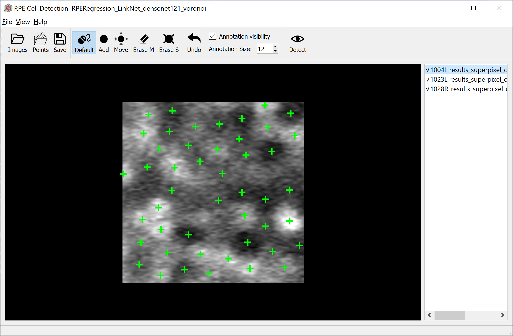
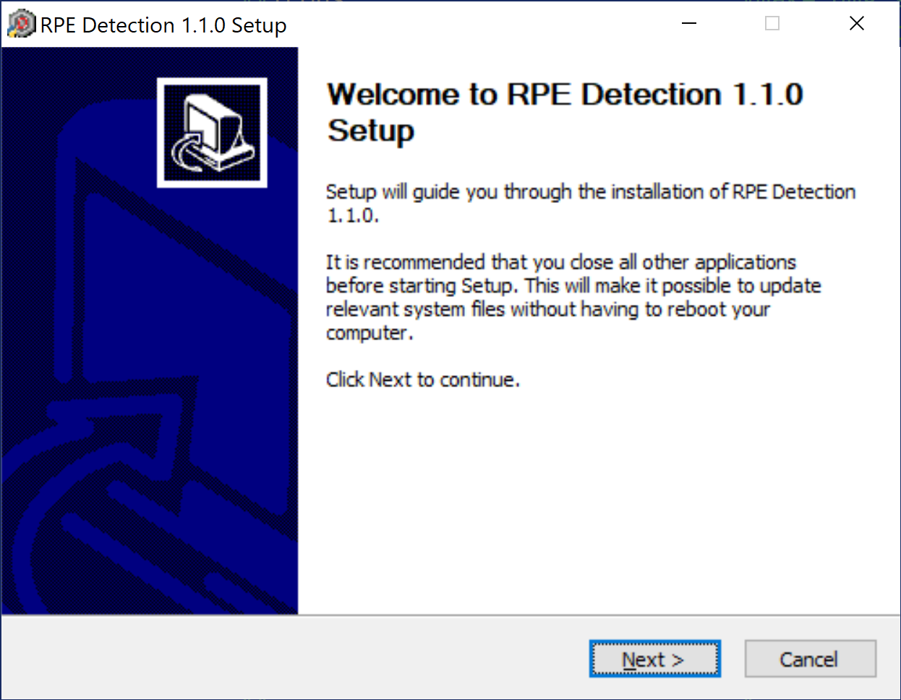
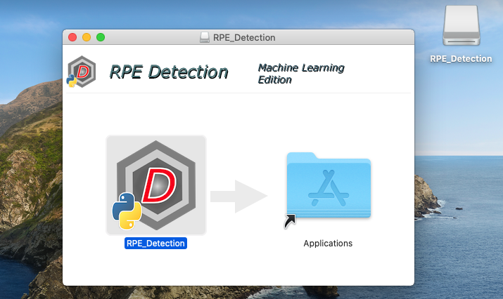

# RPE Detection
#### A software package for identifying RPE cells in non-confocal adaptive optics images, using pre-trained A-GAN machine learning model and manual editing.

*Jianfei Liu (NEI/NIH), Andrei Volkov (NEI/NIH Contractor), and Johnny Tam (NEI/NIH), with research support from the Intramural Research Program of the National Institutes of Health.*

### BibTeX

	@ARTICLE{9122548,
		author={Liu, Jianfei and Han, Yoo-Jean and Liu, Tao and Aguilera, Nancy and Tam, Johnny},
		journal={IEEE Journal of Biomedical and Health Informatics},
		title={Spatially Aware Dense-LinkNet Based Regression Improves Fluorescent Cell Detection in Adaptive Optics Ophthalmic Images},
		year={2020},
		volume={24},
		number={12},
		pages={3520-3528},
		doi={10.1109/JBHI.2020.3004271}}



---------------

## Setting up development environment

1. Download and install [Miniconda](https://docs.conda.io/en/latest/miniconda.html) or [Anaconda](https://www.anaconda.com/products/individual).

2. Check out **RPE_Detection** to a local directory `<prefix>/RPE_Detection`. (Replace `<prefix>` with any suitable local directory).

3. Run Anaconda Prompt (or Terminal), cd to `<prefix>/RPE_Detection`.

4. Create Conda Virtual Environment (do this once, next time skip to the next step):

	`conda env create --file conda-environment-win.yml` (Windows)

	`conda env create --file conda-environment-mac.yml` (Mac OS)
   
5. Activate the Virtual Environment:

	`conda activate RPE_Detection`
   
6. Start the application:

	`python __main__.py`
  
7. Build "frozen Python" application:

	`pyinstaller --clean --noconfirm build-dir.spec`

If successful, the result is the directory `RPE_Detection` inside `<prefix>/RPE_Detection/dist/`. You can copy this directory with all its contents to a different machine, and run the executable `__main__` (in MacOS and Linux) or `__main__.exe` (in Windows). It does not need Conda VEs or other development tools.

In MacOS systems, you can build a Mac application instead:

`pyinstaller --clean --noconfirm build-app-dir.spec`

The result is `<prefix>/RPE_Detection/dist/RPE_Detection.app`.

## Creating Windows installer using NSIS

1. Download and install [NSIS](https://nsis.sourceforge.io/Download) if you don't have it already.

2. Follow steps 1 through 7 of *Setting up development environment* to build the directory containing "frozen Python" application.

3. Open Command Prompt (or Conda Prompt), cd to `<prefix>/RPE_Detection`.

4. Run NSIS:

`"C:\Program Files (x86)\NSIS\makensis.exe" /V4 build-win64-installer.nsi`

(Replace `C:\Program Files (x86)\NSIS` with the actual installation directory, if different from default).
If successful, the result is `<prefix>/RPE_Detection/dist/RPE_Detection-{version}-win64.exe`. This is a regular Windows installer, which can be distributed to other Windows systems. It requires admin access.



## Creating MAC OS installer (.dmg)

1. Make sure Xcode is installed (normally, via Apple App Store).

2. Install *Node.js*, *npm* and *dmg-license* (require admin/sudo access), if they are not already installed:

	```
	curl -L https://raw.githubusercontent.com/tj/n/master/bin/n -o n
	sudo bash n lts
	sudo npm install --global minimist
	sudo npm install --global dmg-license
	rm n
	```

3. Follow steps 1 through 5 of *Setting up development environment* to setup the development environment.

4. At the Conda prompt with *RPE_Detection* activated, cd to `<prefix>/RPE_Detection` and type the command:

	`bash make_dmg.sh`

If prompted to allow Terminal to run Finder scripts, answer "Allow". The result is `<prefix>/RPE_Detection/dist/RPE_Detection-{version}-Darwin.dmg`. It is a Mac OS disk image file; when opened, it asks for accepting the license agreement, then mounts itself as an external drive and opens a Finder window, that looks like this:



You can run the app by double-clicking on the icon, or copy it to your Applications folder by dragging the icon over "Applications". Once RPE_Detection is in your Applications folder, you can eject the *RPE_Detection* disk, and delete `RPE_Detection-{version}-Darwin.dmg`.

---------------

## Deleting Conda Virtual Environment

To delete the Virtual environment at the Conda prompt, deactivate it first if it is active:

`conda deactivate`

then type:

`conda remove --name RPE_Detection`
   